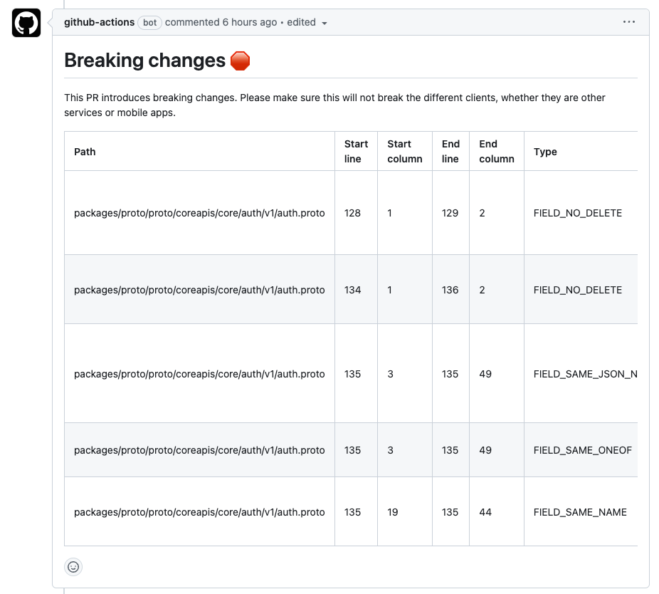

# json-to-markdown-table-action

Github Action that uses [`tablemark`](https://github.com/haltcase/tablemark) to convert a JSON into a Markdown table.

## Usage

Here is an example on how to use this action. This example posts a comment on an PR if there are breaking changes in proto files.



```yaml
- uses: bufbuild/buf-breaking-action@v1
  id: breaking
  continue-on-error: true
  with:
    input: packages/proto
    against: '$GITHUB_SERVER_URL/$GITHUB_REPOSITORY.git#branch=main,subdir=packages/proto'
- uses: buildingcash/json-to-markdown-table-action@v1
  if: steps.breaking.outcome == 'failure'
  id: table
  with:
    json: ${{ steps.breaking.outputs.results }}
- name: Comment PR
  uses: thollander/actions-comment-pull-request@v2
  if: steps.breaking.outcome == 'failure'
  with:
    message: |
      # Breaking changes 🛑
      This PR introduces breaking changes. Please make sure this will not break the different clients, whether they are other services or mobile apps.

      ${{ steps.table.outputs.table }}
```
